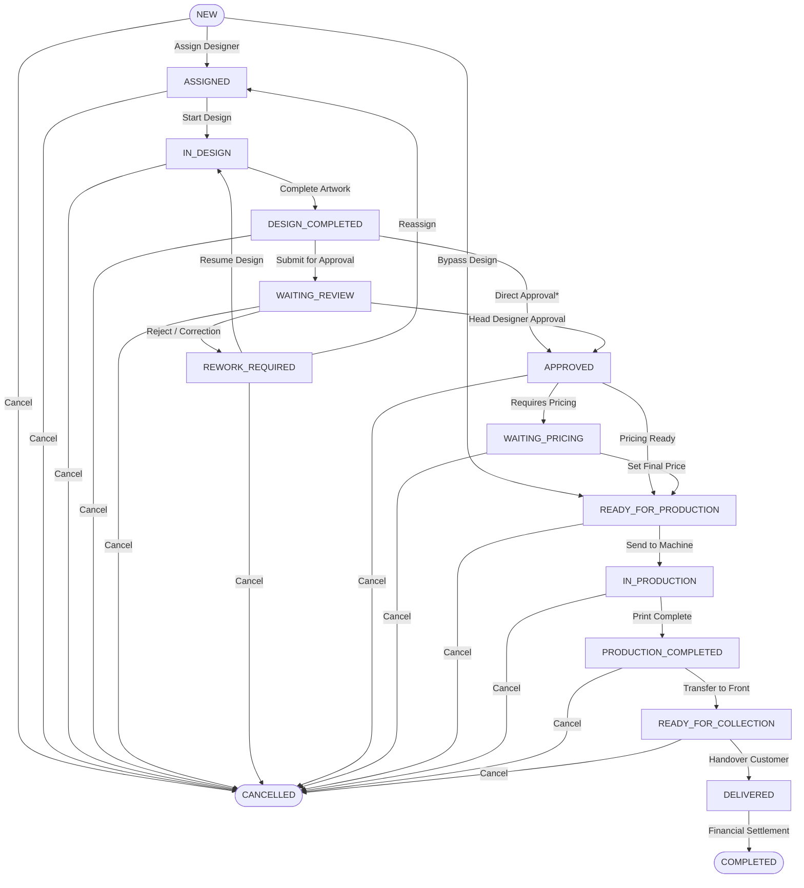

# Printex (برنتكس) — Print Shop Operating System & Workflow Engine

<div align="center">

[](https://github.com/mostafammy/Printex/actions/workflows/ci.yml)
[](https://www.typescriptlang.org/)
[](https://nextjs.org/)
[](https://react.dev/)
[](https://www.prisma.io/)
[](https://tailwindcss.com/)
[](https://vitest.dev/)
[](#system-architecture)
[](#license)

**A mission-critical, local-first internal operating system for high-throughput commercial printing facilities.**

[Key Capabilities](#key-capabilities) •
[Architecture](#system-architecture) •
[State Machine](#work-item-state-machine) •
[Quickstart](#quickstart-5-minute-setup) •
[Engineering Constitution](#engineering-constitution) •
[Testing](#testing--quality-gates)

</div>

---

## Executive Overview

Commercial print operations suffer from a classic distributed coordination failure: orders arrive across fragmented channels (walk-ins, phone calls, WhatsApp messages, direct-to-designer requests) and move through physical production gates tracked only by paper job jackets, manual desktop folders, and verbal handoffs. Jobs disappear into operational black holes, specifications get overwritten, unapproved jobs reach print beds, and deliveries take place before accounting pricing is finalized.

**Printex** eliminates this failure mode by establishing a single, immutable source of operational truth. It models the entire commercial printing lifecycle as an inviolable, finite state machine where **Order status is computed as a pure function of its child Work Items**, operational mutations are strictly append-only, and every sensitive action generates a tamper-proof audit trail enforced at the PostgreSQL engine level.

```
Customer Request ──► Order ──► Work Items ──► Design ──► Review ──► Production ──► Collection ──► Delivery ──► Financial Closure
```

---

## Key Capabilities & Engineering Invariants

* **Canonical Domain Hierarchy (`Customer → Order → WorkItem`)**: Every request—regardless of origin channel—is captured as an Order containing one or more independently tracked Work Items (e.g., Banners, Digital Printing, Laser Cutting, Stickers).
* **Pure Derived Order Status**: Order status is an invariant computed synchronously from active Work Item states. Application code cannot set or update an Order's status directly—preventing status desynchronization by construction.
* **Inviolable Business Control Gates**:
  * *Four-Eyes Review*: Designers cannot approve their own artwork; Head Designer sign-off is mandatory before routing to production.
  * *Pricing-Before-Delivery*: Finished goods cannot be marked as delivered while variable pricing remains unfinalized.
  * *Audit Rollback Atomicity*: State transitions, phase timings, and audit records commit within the same ACID database transaction; if audit recording fails, the entire transition rolls back.
* **Database-Enforced Append-Only Audit Trail**: Application code never updates or deletes operational history. Audit logs are protected at the database engine level via PostgreSQL `REVOKE UPDATE, DELETE ON audit_event FROM CURRENT_USER`.
* **Local-First & LAN Resilient**: Built for zero-downtime on-premises deployment on a local factory LAN. Core workflows require zero Internet connectivity. External integrations (e.g., WhatsApp gateway) are isolated behind outbound queues and cannot block core operations.
* **Arabic-First (RTL) Native UX**: Fully localized right-to-left UI engineered with CSS Logical Properties (`ms-*`, `me-*`, `start-*`, `end-*`). Physical direction utilities (`ml-*`, `mr-*`, `left-*`, `right-*`) are rejected at build-time via custom ESLint AST rules.
* **Role-Based Access Control (RBAC)**: 7 granular operational roles (`RECEPTION`, `DESIGNER`, `HEAD_DESIGNER`, `OPERATOR`, `PRINT_RECEPTION_DELIVERY`, `ACCOUNTING`, `ADMIN_OWNER`) with strict department-scoped execution boundaries.

---

## System Architecture

Printex is implemented following **Hexagonal Architecture (Ports and Adapters)** principles. The domain engine is decoupled from frameworks, transport layers, and persistence mechanisms.

```
                              ┌────────────────────────────────────────────────────────┐
                              │                    Presentation Layer                  │
                              │       Next.js 15 App Router (RTL Shell / Pages)        │
                              └───────────────────────────┬────────────────────────────┘
                                                          │ Server Actions / RPC
                                                          ▼
┌──────────────────────────────────────────────────────────────────────────────────────────────────────────────┐
│                                             Core Domain Hexagon                              │
│                                                                                                              │
│   ┌──────────────────────────────────────────────────────────────────────────────────────────────────────┐   │
│   │                                            Domain Engine                                             │   │
│   │                                                                                                      │   │
│   │   • transitionWorkItem() (Single Mutator)        • deriveOrderStatus() (Pure Function)               │   │
│   │   • Guard Registry (Precondition Checks)         • PhaseTiming Recorder (Queue vs. Active)           │   │
│   │   • Branded IDs (CustomerId, WorkItemId)         • Result<T, DomainError> (Zero-Throw Policy)        │   │
│   └──────────────────────────────────────────────────────────────────────────────────────────────────────┘   │
│                                                          ▲                                                   │
│                                                          │ Implements Ports                                  │
│            ┌─────────────────────────────────────────────┴─────────────────────────────────────────────┐     │
│            ▼                                             ▼                                             ▼     │
│   ┌──────────────────┐                         ┌──────────────────┐                         ┌──────────────────┐   │
│   │  StorageAdapter  │                         │   Outbox/Notify  │                         │   AuditRecorder  │   │
│   │   (Local Disk)   │                         │  (Notification)  │                         │  (Append-Only)   │   │
│   └────────┬─────────┘                         └────────┬─────────┘                         └────────┬─────────┘   │
└────────────┼────────────────────────────────────────────┼────────────────────────────────────────────┼───────┘
             ▼                                            ▼                                            ▼
      Local Filesystem                              PostgreSQL DB                                 PostgreSQL
     (Private Checksums)                         (Multi-File Schema)                        (REVOKE UPDATE/DELETE)
```

### Compile-Time Architectural Boundaries

These boundaries are statically enforced via ESLint AST selectors on every commit (`pnpm check`):

1. **`src/server/core/**` is isolated**: Cannot import from `src/app/**` or feature modules under `src/server/*/**`.
2. **Strict Public Barrel Surface**: External modules must consume core through `~/server/core` (`src/server/core/index.ts`). Deep imports into `core/internals` fail linting.
3. **Zero-Throw Policy**: Functions in `src/server/core` return `Result<T, DomainError>` Monads. `throw` statements are disallowed (exempting only exhaustiveness assertions).
4. **Logical Properties Only**: Physical direction CSS classes (`ml-`, `mr-`, `pl-`, `pr-`, `left-`, `right-`) fail linting in all JSX/TSX components.

---

## Work Item State Machine

Every Work Item adheres to an explicit 15-state Finite State Machine. The table below represents the authoritative state transition topology:



*\* Direct approval from `DESIGN_COMPLETED` is permitted only for work items configured with `requiresReview = false`.*

---

## Tech Stack

| Layer | Technology | Selection Rationale |
| :--- | :--- | :--- |
| **Runtime & Language** | **Node.js 20+ / TypeScript 5.8** | Full strict-mode TypeScript with branded primitive types (`OrderId`, `WorkItemId`). |
| **Framework** | **Next.js 15.2 (App Router)** | High-performance React 19 Server Components, streaming SSR, and Turbopack. |
| **Database & ORM** | **PostgreSQL 16 + Prisma 6.6** | Multi-file schema (`prismaSchemaFolder`), exact `Decimal` precision for financials, sequence generators. |
| **Authentication & RBAC**| **Better Auth 1.3** | Custom username credentials provider, session invalidation, and rate-limited lockout (5 attempts / 15m). |
| **State & Validation** | **Zod 3.24** | Runtime schema boundary validation for all external API endpoints and Server Actions. |
| **Styling & UI Shell** | **Tailwind CSS v4 + Radix UI** | Modern CSS-first design system with complete RTL logical property enforcement. |
| **Testing** | **Vitest 5.0 + Testing Library** | In-memory and dual-database transactional integration testing suite. |
| **Package Manager** | **pnpm 10+** | Deterministic, space-efficient dependency management with frozen lockfiles. |

---

## Project Structure

```text
Printex/
├── .github/workflows/          # CI/CD automation (PostgreSQL services, lint, check, test)
├── .specify/                   # Engineering governance, memory, and constitution
│   └── memory/constitution.md  # The 9 inviolable architectural principles
├── prisma/
│   ├── manual-sql/             # Engine-level security triggers (audit append-only revocation)
│   ├── schema/                 # Split Prisma multi-file schema
│   │   ├── core.prisma         # Order, WorkItem, Transition, Department, Customer models
│   │   ├── identity.prisma     # Better Auth, RBAC roles, permissions, audit_event tables
│   │   └── schema.prisma       # Generator config and datasource configuration
│   └── seed.ts                 # Idempotent database seeder (roles, users, departments)
├── public/                     # Static production assets
├── specs/                      # Spec-Kit feature specifications and design contracts
│   ├── 001-identity-access-audit
│   └── 002-core-domain-shell
├── src/
│   ├── app/                    # Next.js App Router presentation layer
│   │   ├── (shell)/            # Authenticated Arabic RTL operational shell
│   │   │   ├── _components/    # Sidebar, topbar, navigation breadcrumbs
│   │   │   ├── my-queue/       # Role-based queue landing view
│   │   │   └── nav.ts          # RBAC-filtered navigation configuration
│   │   ├── api/                # API routes & Better Auth handlers
│   │   ├── layout.tsx          # Root HTML layout (<html dir="rtl" lang="ar">)
│   │   └── page.tsx            # Root redirect / landing view
│   ├── components/             # Reusable UI primitives (shadcn/ui, buttons, tables)
│   ├── env.js                  # Type-safe environment variable schema (@t3-oss/env-nextjs)
│   └── server/
│       ├── auth/               # Better Auth instance, session guards, audit dispatcher
│       ├── core/               # Hexagonal domain engine (ISOLATED DOMAIN LAYER)
│       │   ├── notifications/  # Transactional outbox event emitter
│       │   ├── orders/         # Pure derived Order status evaluator
│       │   ├── storage/        # StorageAdapter interface & local disk port implementation
│       │   ├── workflow/       # FSM: states, allowed edges, guards, and transitionWorkItem()
│       │   ├── actor.ts        # Authenticated principal context representation
│       │   ├── errors.ts       # Typed domain errors & ActionResult serializers
│       │   ├── ids.ts          # Nominal branded ID factories
│       │   ├── index.ts        # EXCLUSIVE public barrel export for core
│       │   └── result.ts       # Result<T, DomainError> functional Monad implementation
│       └── db.ts               # Global Prisma client singleton
├── tests/                      # Comprehensive test taxonomy
│   ├── contract/               # External ports & StorageAdapter compliance tests
│   ├── factories/              # Test fixture builders (User, Order, WorkItem)
│   ├── helpers/                # Test database harness & isolation utilities
│   ├── integration/            # Concurrency & ACID transaction rollback integration tests
│   └── unit/                   # State machine matrix, order derivation, and navigation tests
├── eslint.config.js            # Custom architectural boundary & RTL AST lint rules
├── start-database.sh           # Local development PostgreSQL container manager
└── vitest.config.ts            # Test runner configuration (dual-DB isolation)
```

---

## Quickstart (5-Minute Setup)

### Prerequisites

* [Node.js](https://nodejs.org/) `>= 20.14.0`
* [pnpm](https://pnpm.io/) `>= 9.0.0`
* [Docker](https://www.docker.com/) or [Podman](https://podman.io/) (for local database)

### 1. Clone & Install Dependencies

```bash
git clone https://github.com/mostafammy/Printex.git
cd Printex
pnpm install
```

### 2. Configure Environment

Copy the example environment template:

```bash
cp .env.example .env
```

Review `.env` to verify default settings:
* `DATABASE_URL`: Primary application database connection string.
* `DATABASE_URL_TEST`: Isolated database instance for the Vitest test runner.
* `STORAGE_ROOT`: Filesystem directory for local attachment storage (defaults to `./.storage`).

### 3. Spin Up Local PostgreSQL

Run the automated container manager script:

```bash
chmod +x ./start-database.sh
./start-database.sh
```

### 4. Push Schema & Seed Initial Fixtures

Push the multi-file schema and run the idempotent seed script:

```bash
pnpm db:push
pnpm exec prisma db seed
```

*(Optional: Enforce database-level append-only protection on audit records)*:
```bash
pnpm exec prisma db execute --file prisma/manual-sql/audit-event-append-only.sql --schema prisma/schema
```

### 5. Start the Development Server

Launch the Next.js development server with Turbopack:

```bash
pnpm dev
```

Open [http://localhost:3000](http://localhost:3000) in your browser.

---

## Seeded Development Personas

The seed script creates the following pre-configured user accounts with seeded roles and departments:

| Role Key | Username | Initial Password | Permitted Department(s) | Primary Purpose |
| :--- | :--- | :--- | :--- | :--- |
| `ADMIN_OWNER` | `admin` | `Admin@123456` | *Global Access* | System administration, user & role provisioning, audit inspection. |
| `RECEPTION` | `reception1` | `Reception@123456` | Front Office | Walk-in / phone / WhatsApp job intake, customer lookups. |
| `DESIGNER` | `designer1` | `Designer@123456` | Design Studio | Active artwork preparation, revision uploading. |
| `HEAD_DESIGNER` | `headdesigner` | `Head@123456` | Design Studio | Artwork review, four-eyes gate approval, rework rejections. |
| `OPERATOR` | `operator1` | `Operator@123456` | Digital, Banner | Machine queues, print execution, production time tracking. |
| `PRINT_RECEPTION_DELIVERY` | `delivery1` | `Delivery@123456` | Dispatch | Finished goods collection, packaging, customer handovers. |
| `ACCOUNTING` | `accountant1` | `Accountant@123456`| Finance | Pricing review, payment recording, financial reconciliation. |

---

## Command Reference

| Script | Command | Description |
| :--- | :--- | :--- |
| **Development** | `pnpm dev` | Starts the Next.js development server with Turbopack enabled. |
| **Typecheck** | `pnpm typecheck` | Executes `tsc --noEmit` across all workspace modules. |
| **Lint** | `pnpm lint` | Runs Next.js ESLint with custom hexagonal & RTL boundary checks. |
| **Check** | `pnpm check` | Atomic CI gate: runs `next lint` and `tsc --noEmit`. |
| **Unit & Integration Tests** | `pnpm test` | Runs the full Vitest suite against `DATABASE_URL_TEST`. |
| **Test Watcher** | `pnpm test:watch` | Runs Vitest in interactive watch mode for TDD workflows. |
| **Database Sync** | `pnpm db:push` | Pushes Prisma multi-file schema changes to the active database. |
| **Database Studio** | `pnpm db:studio` | Launches Prisma Studio GUI for relational inspection. |
| **Format Check** | `pnpm format:check` | Validates code formatting via Prettier with Tailwind plugin. |
| **Format Write** | `pnpm format:write` | Formats all source files with Prettier. |
| **Production Build** | `pnpm build` | Compiles the production build for on-premises deployment. |
| **Production Start** | `pnpm start` | Launches the pre-compiled production build. |

---

## Testing & Quality Gates

Printex maintains a zero-regression testing posture backed by an automated CI pipeline.

```
Tests Run: 15×15 Transition Matrix • Concurrency Locks • Audit Rollback • Hexagonal AST
```

### 1. Dual-Database Test Isolation
To prevent tests from corrupting local development data or race-conditioning transactions, the test suite executes exclusively against `DATABASE_URL_TEST`. The database schema is reset and migrated prior to running test suites.

### 2. Comprehensive Test Taxonomy
* **State Machine Matrix Tests (`tests/unit/workflow-edges.test.ts`)**: Exhaustively validates every allowed transition in `ALLOWED_EDGES` and verifies that all illegal transitions reject with `INVALID_TRANSITION`.
* **Derived Status Tests (`tests/unit/deriveOrderStatus.test.ts`)**: Validates the 6-bucket Order status derivation algorithm across all permutation combinations.
* **ACID Transaction Rollback Tests (`tests/integration/transition-rollback.test.ts`)**: Asserts that if an audit event or phase timing fails during a transition, the parent `WorkItem.state` write is rolled back completely.
* **Storage Port Contracts (`tests/contract/storageAdapter.test.ts`)**: Validates that all file storage adapters adhere to file versioning, checksum hashing, and boundary access control.
* **Logical Properties Lint Guard (`eslint.config.js`)**: Static analysis rule rejecting any physical directional classes in JSX.

To execute the test suite locally:
```bash
pnpm test
```

---

## Engineering Constitution

Development on Printex is strictly governed by the 9 Core Principles defined in [`.specify/memory/constitution.md`](.specify/memory/constitution.md):

1. **Order → Work Item Is the Canonical Model**: Work Items are the atomic operational objects. Parallel workflows (folders, chat threads) are prohibited.
2. **Business Gates Are Inviolable**: Review gates, pricing checks, and audit logging cannot be bypassed by shortcuts or administrative overrides.
3. **History Is Append-Only**: Records are never hard-deleted. Removal is modeled as Archive, Void, or Supersede.
4. **Files Are Immutable, Private Versions**: Overwriting file binaries in place is prohibited. New uploads increment versions with SHA-256 checksums.
5. **The Server Is the Only Authority**: Client-side authorization or calculation is untrusted. Gates execute server-side in ACID transactions.
6. **Configuration Over Hard-Coding**: Production departments, pricing rules, and rejection categories are persisted database entities, not hard-coded enums.
7. **Local-First, Isolated Integrations**: Core workflows remain 100% functional on a local LAN during complete Internet outages.
8. **AI Is Optional and Assistive**: System functions fully with AI disabled. AI output is advisory, non-authoritative, and labeled.
9. **Arabic-First, Task-Oriented UX**: RTL layout is standard. Workstations are organized around task queues, not raw database entity tables.

---

## Contributing & Development Workflow

Printex uses the **Spec-Kit** engineering workflow for all feature delivery:

1. **Specify (`/speckit-specify`)**: Define product specifications grounded in the PRD.
2. **Clarify (`/speckit-clarify`)**: Resolve ambiguities and edge cases before coding.
3. **Plan (`/speckit-plan`)**: Execute Constitution checks and architectural boundary design.
4. **Tasks (`/speckit-tasks`)**: Break implementation down into dependency-ordered testable slices.
5. **Implement (`/speckit-implement`)**: Execute tasks with strict red-green-refactor discipline.

### Commit Standards
All commits must follow the [Conventional Commits](https://www.conventionalcommits.org/) specification:
* `feat(workflow)`: Add external guard for banner department
* `fix(orders)`: Correct partial delivery derivation bucket
* `test(fsm)`: Add table-driven transition tests for rework loop
* `refactor(core)`: Isolate storage adapter contract

---

## Security & Vulnerability Reporting

Printex enforces the Principle of Least Privilege:
* Sensitive database operations require multi-tenant transaction isolation.
* Secrets are validated at boot time via `@t3-oss/env-nextjs` in `src/env.js`.
* Hard deletes are physically disabled on audit tables in PostgreSQL.

To report security vulnerabilities, contact the internal engineering team or file an encrypted issue marked `[SECURITY]`.

---

## License

Copyright © 2026 Printex. All rights reserved.  
Confidential and Proprietary. Built for internal commercial print operations.
