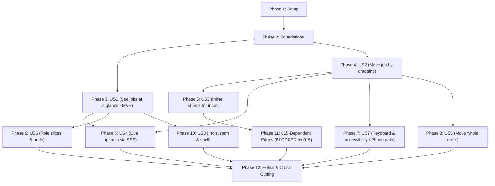

# Tasks: Press Floor Board

**Input**: Design documents from `/specs/017-press-floor-board/` (`spec.md`, `plan.md`, `research.md`, `data-model.md`, `contracts/`, `quickstart.md`).

**Prerequisites**:
- `specs/017-press-floor-board/plan.md` (tech context, project structure, engineering standards S1–S6, delivery slices, complexity tracking)
- `specs/017-press-floor-board/spec.md` (US1–US8, FR-001..FR-035, SC-001..SC-010)
- `specs/017-press-floor-board/research.md` (R1–R14 decisions; R3 edge catalog)
- `specs/017-press-floor-board/data-model.md` (STATE_PLACEMENT, DTOs, trigger, object model)
- `specs/017-press-floor-board/contracts/` (`board-server.md`, `board-live-sse.md`, `board-engine.md`, `ink-tokens.md`)
- `.specify/memory/constitution.md` (principles I–IX, testing invariants)

> [!IMPORTANT]
> **Prerequisite Dependency Note**: PRI-66 (system auto-routing of approved/priced Work Items from `APPROVED → WAITING_PRICING / READY_FOR_PRODUCTION` and `WAITING_PRICING → READY_FOR_PRODUCTION`) must merge before go-live. Without PRI-66, Review and Pricing columns never empty in live workflows. PRI-66 is tracked independently and is NOT a task in this list.

**Organization**:
Tasks are ordered into 12 phases: Setup, Foundational, one phase per User Story in delivery order (US1 MVP, US2, US3, US4, US7, US5, US6, US8 — where US7 is scheduled before US5/US6 as it defines the phone accessibility path), followed by the 015-dependent edges phase (blocked by feature 015), and Polish. In each user story phase, tests are listed first and must fail before implementation.

**Format**: `- [ ] T### [P?] [US#?] Description with exact file paths (Source references)`
- `[P]`: Can run in parallel (touches different files with no dependencies on incomplete tasks).
- `[US#]`: User story label (present only in User Story phases 3–10).

---

## Phase 1: Setup (Shared Infrastructure)

**Purpose**: Project dependency installation, lint boundaries, metric limits, configuration files, and database migration prerequisites.

- [X] T001 Add new npm dependencies `@dnd-kit/core` (^6.x), `pg` (^8.x), and devDependency `@types/pg` to `package.json` (plan.md §Technical Context, research.md R4, R7)
- [X] T002 [P] Configure ESLint architectural boundary rules in `eslint.config.js` to forbid `react`, `react-dom`, and `next` imports within `src/lib/board/**`, forbid `src/lib/board/**` from importing `src/components/**` or `src/server/**` (allowing `import type` only from `src/server/board` DTO type modules), forbid `src/server/**` imports from `src/components/**`, and require public barrel imports for `~/server/board` (plan.md §Project Structure, S4, research.md R1)
- [X] T003 Configure ESLint metric limits in `eslint.config.js` scoped ONLY to `src/lib/board/**`, `src/server/board/**`, `src/components/board/**`, and `src/components/shell/**`: `max-lines` 150 (`200` for `*.tsx`, `skipBlankLines: true`, `skipComments: true`), `max-lines-per-function` 40, `complexity` 8, `max-params` 3, and `max-depth` 3 (plan.md S1)
- [X] T004 [P] Create CI token verification script in `scripts/check-no-apple-tokens.mjs` executing a recursive grep over `src/` asserting zero occurrences of `apple-` token identifiers remain (plan.md S6, contracts/ink-tokens.md §Removed from globals.css)
- [X] T005 [P] Create station targets configuration file in `config/017-board.yaml` specifying target minutes for normal and urgent priority across all 7 stations: `reception: { normal: 30, urgent: 10 }`, `design: { normal: 1440, urgent: 240 }`, `review: { normal: 240, urgent: 60 }`, `pricing: { normal: 240, urgent: 60 }`, `production: { normal: 2880, urgent: 480 }`, `collection: { normal: 1440, urgent: 240 }`, `delivered: { normal: 0, urgent: 0 }` (data-model.md §1.3, research.md R10, FR-007)
- [X] T006 [P] Create Postgres notification trigger SQL script in `prisma/manual-sql/board-transition-notify.sql` defining `board_transition_notify` trigger `AFTER INSERT ON "WorkItemTransition" FOR EACH ROW` executing `pg_notify('board_transition', json_build_object('id', NEW.id, 'workItemId', NEW."workItemId", 'orderId', (SELECT "orderId" FROM "WorkItem" WHERE id = NEW."workItemId"), 'from', NEW."from", 'to', NEW."to", 'actorId', NEW."actorId", 'at', NEW."at")::text)` (data-model.md §1.2, research.md R4, FR-024)
- [X] T007 Add `"workitem.send_to_production"` to `Permission` union type and `ALL_PERMISSIONS` runtime array in `src/server/auth/permissions.ts` (data-model.md §1.1, research.md R12, FR-015a)
- [X] T008 Create Prisma migration in `prisma/migrations/20260926_board_live_and_send_to_production/migration.sql` applying `board-transition-notify.sql` and executing idempotent SQL grant of `"workitem.send_to_production"` to roles `RECEPTION` and `ADMIN_OWNER` in table `RolePermission` (plan.md §Project Structure, data-model.md §1.1, §1.2)
- [X] T009 Update seed script in `prisma/seed.ts` to include `"workitem.send_to_production"` in default seeded permissions for `RECEPTION` and `ADMIN_OWNER` (data-model.md §1.1, plan.md §Project Structure)
- [X] T010 [P] Update contract test in `tests/contract/role-permission-matrix.test.ts` to assert `"workitem.send_to_production"` is present in seeded permissions for `RECEPTION` and `ADMIN_OWNER` (research.md R12, data-model.md §1.1)

---

## Phase 2: Foundational (Blocking Prerequisites)

**Purpose**: Core constants, configuration loaders, visibility logic, tokens, and engine port abstractions that block all user stories.

**⚠️ CRITICAL**: No user story implementation can begin until this foundational phase is complete.

- [X] T011 [P] Implement station mapping and placements in `src/server/board/stations.ts` exporting `StationId = "reception" | "design" | "review" | "pricing" | "production" | "collection" | "delivered"`, `STATIONS` array (with Arabic labels "الاستقبال", "التصميم", "المراجعة", "التسعير", "الإنتاج", "التجهيز للتسليم", "تم التسليم", inks, and Lucide icons), and `STATE_PLACEMENT = { NEW: { station: "reception", lane: 0 }, ASSIGNED: { station: "design", lane: 0 }, IN_DESIGN: { station: "design", lane: 1 }, REWORK_REQUIRED: { station: "design", lane: 2 }, DESIGN_COMPLETED: { station: "design", lane: 3 }, WAITING_REVIEW: { station: "review", lane: 0 }, APPROVED: { station: "review", lane: 1 }, WAITING_PRICING: { station: "pricing", lane: 0 }, READY_FOR_PRODUCTION: { station: "production", lane: 0 }, IN_PRODUCTION: { station: "production", lane: 1 }, PRODUCTION_COMPLETED: { station: "collection", lane: 0 }, READY_FOR_COLLECTION: { station: "collection", lane: 1 }, DELIVERED: { station: "delivered", lane: 0 }, COMPLETED: "OFF_BOARD", CANCELLED: "OFF_BOARD" } satisfies Record<WorkItemState, Placement>` (FR-002, data-model.md §2, plan.md S1)
- [X] T012 [P] Implement station targets config loader and Zod schema in `src/server/board/config.ts` loading `config/017-board.yaml` (overridable via `process.env.BOARD_CONFIG_PATH`) with positive integer validation for all 7 stations and default fallbacks (data-model.md §1.3, research.md R10, plan.md S1)
- [X] T013 [P] Implement floor visibility functions `canSeeWorkItem(actor, card)` and `toPrismaWhere(actor)` in `src/server/board/visibility.ts` enforcing floor-wide permissions vs `assigneeId = actor.userId` for `design.work` and `effectiveDepartmentId in actor.departmentIds` for `production.operate` (research.md R6, contracts/board-server.md §Visibility, FR-022, plan.md S1)
- [X] T014 [P] Implement role slices resolution in `src/server/board/slices.ts` defining `SliceId = "reception" | "designer" | "head-designer" | "production" | "delivery" | "accounting" | "floor"`, default slice mapping per role, and multi-role precedence `Admin > Head Designer > Accounting > Reception > Delivery staff > Production operator > Designer` (FR-021, data-model.md §3.7, plan.md S1)
- [X] T015 [P] Implement refusal codes and Arabic localized messages dictionary in `src/server/board/messages.ts` mapping each `MoveRefusalCode` verbatim (`"NOT_OFFERED" | "FORBIDDEN" | "STALE_STATE" | "GUARD_FAILED" | "VALIDATION" | "DEPENDENCY_UNAVAILABLE" | "INTERNAL"`) to Arabic explanations (data-model.md §3.4, contracts/board-server.md §3, plan.md S1)
- [X] T016 [P] Implement ink token layers and motion tokens in `src/styles/ink.css` defining 8 primitive inks (`cyan`, `magenta`, `violet`, `yellow`, `key`, `orange`, `green`, `red`) with `-fill`, `-edge`, `-text`, `-wash` in OKLCH for `:root` and `.dark`, semantic station tokens `--station-<id>-*`, signal tokens `--signal-backward`, `--signal-destructive`, `--signal-overdue` mapping to `--ink-red`, component tokens `[data-station]`, and `--motion-*` spring/duration tokens (contracts/ink-tokens.md, research.md R9, FR-027, FR-027a, FR-029)
- [X] T017 [P] Define TypeScript client engine ports in `src/lib/board/ports.ts` with no React/DOM globals: `MoveGateway` (`move`, `moveGroup`, `cards`), `SnapshotGateway` (`snapshot`), `LiveSource` (`subscribe`), `MotionPort` (`play`, `measure`), `FeedbackPort` (`notify`), and `Clock` (`now`) (contracts/board-engine.md §Ports, research.md R1, plan.md S2-I)
- [X] T018 [P] Implement system clock adapter in `src/lib/board/adapters/SystemClock.ts` implementing `Clock` port via `Date.now()` (contracts/board-engine.md §Ports, plan.md S2-D)
- [X] T019 [P] Create mock test fakes in `tests/unit/board/fakes.ts` implementing `FakeMoveGateway`, `FakeSnapshotGateway`, `FakeLiveSource`, `FakeMotionPort`, `FakeFeedbackPort`, and `FakeClock` for Vitest unit tests (contracts/board-engine.md §Ports, plan.md S2-L)
- [X] T020 [P] Write unit tests for station mapping completeness in `tests/unit/board/stations.test.ts` verifying that every state in `WORK_ITEM_STATES` maps to exactly one station and sub-lane, off-board states map to `OFF_BOARD`, and no unknown states exist (FR-002, data-model.md §2)
- [X] T021 [P] Write unit tests for ink contrast verification in `tests/unit/board/ink-contrast.test.ts` calculating OKLCH to sRGB contrast ratios for all `--ink-*-text` on `--surface-ticket` and `--surface-lane` to verify ≥ 4.5:1 in both light and dark modes and non-station red enforcement (FR-027, FR-027a, FR-029, contracts/ink-tokens.md §Rules)

**Checkpoint**: Core foundation, data contracts, metric rules, and ports ready. User stories can now proceed.

---

## Phase 3: User Story 1 - See where every job is at a glance (Priority: P1, MVP) 🎯

**Goal**: Deliver a read-only live board where an admin or staff member opens Printex, lands on the board with 7 station columns in RTL flow, and sees every visible active Work Item card in its correct column/sub-lane with customer, order tag, title, urgency, overdue indicator, and pricing badge.

**Independent Test**: Seed Work Items in every non-terminal state across multiple Orders. Open `/board` as admin and verify each card appears in exactly one column and sub-lane per `STATE_PLACEMENT` (FR-002), siblings share an order tag, urgent items sort first, overdue indicators flag delayed items, and `COMPLETED`/`CANCELLED` appear only when `archive = true`.

### Tests for User Story 1 ⚠️

- [X] T022 [P] [US1] Write unit tests for board card projection in `tests/unit/board/projection.test.ts` verifying pure mapping of Prisma rows to `BoardCard` DTOs, including hash-derived `orderTagHue` (0–359), pricing badge status, and elapsed duration calculation (spec.md US1, data-model.md §3.1)
- [X] T023 [P] [US1] Write integration test for snapshot visibility in `tests/integration/board/snapshot-visibility.test.ts` testing `getBoardSnapshot` against Designer, Operator, and Admin actors to confirm query boundaries match queue queries and respect `filters.archive` (FR-009, FR-022, contracts/board-server.md §getBoardSnapshot)
- [X] T024 [P] [US1] Write performance budget test in `tests/performance/board-snapshot.test.ts` asserting `getBoardSnapshot` with 500 seeded active Work Items completes in ≤ 4 DB queries with server execution time ≤ 600 ms (contracts/board-server.md §getBoardSnapshot, SC-005, plan.md S5)
- [X] T025 [P] [US1] Write unit tests for LaneIndex in `tests/unit/board/LaneIndex.test.ts` verifying binary-search insertion, item removal, and sub-lane sorting (urgent first, then longest waiting per FR-005) (plan.md S5, FR-005)
- [X] T026 [P] [US1] Write unit tests for TopicEmitter in `tests/unit/board/TopicEmitter.test.ts` verifying fine-grained subscriptions for `"lane:<state>"`, `"card:<id>"`, and `"meta"`, with unsubscribe cleanup and fire-once semantics (plan.md S3, contracts/board-engine.md §BoardStore)
- [X] T027 [P] [US1] Write unit tests for FrameBatcher in `tests/unit/board/FrameBatcher.test.ts` testing `requestAnimationFrame` batching with injectable scheduler clock to ensure notifications fire once per frame (plan.md S5, research.md R8)
- [X] T028 [P] [US1] Write unit tests for BoardStore in `tests/unit/board/store.test.ts` testing composition of `LaneIndex`, `TopicEmitter`, and `FrameBatcher`, normalized `cards` map, and selector stability (contracts/board-engine.md §BoardStore, plan.md S2-S)
- [X] T029 [P] [US1] Write component tests for JobTicket in `tests/components/board/JobTicket.test.tsx` verifying exact accessible name `"<customer> — <title> — <state>"`, button role, shortcut `M`, rendered anatomy, and `React.memo` stability against unrelated store updates (FR-003, FR-007, FR-008, contracts/board-engine.md §Accessibility, plan.md S5)
- [X] T030 [P] [US1] Write component tests for StationColumn and SubLane in `tests/components/board/StationColumn.test.tsx` verifying station ink theme, Lucide icon, Arabic label, card count header, and virtualized sub-lane rendering (FR-001, FR-002, FR-006)
- [X] T031 [P] [US1] Write unit tests for ServerActionSnapshotGateway in `tests/unit/board/ServerActionSnapshotGateway.test.ts` verifying delegation to server actions with error mapping (contracts/board-engine.md §Ports, plan.md S2-L)
- [X] T032 [P] [US1] Write unit tests for createBoardController in `tests/unit/board/createBoardController.test.ts` verifying composition root instantiates controller, store, and injected adapters without circular dependencies (plan.md S2-D, S3)

### Implementation for User Story 1

- [X] T033 [US1] Implement database query projection in `src/server/board/projection.ts` executing ≤ 4 queries (work items + orders + customers, latest transitions window, rework counts, pricing statuses) and mapping rows to `BoardCard` DTOs (data-model.md §3.1, contracts/board-server.md §getBoardSnapshot, plan.md S1)
- [X] T034 [US1] Implement snapshot server queries in `src/server/board/snapshot.ts` providing `getBoardSnapshot(actor, request)` and `getBoardCards(actor, ids)` returning `BoardSnapshot` with `cards`, `hiddenSiblingCounts`, `slice`, `availableSlices`, and `blockedHints` (data-model.md §3.6, contracts/board-server.md §getBoardSnapshot, §getBoardCards, plan.md S1)
- [X] T035 [US1] Implement read-only server actions `getBoardSnapshotAction` and `getBoardCardsAction` in `src/app/(shell)/board/actions.ts` calling `snapshot.ts` (contracts/board-server.md, plan.md S1)
- [X] T036 [US1] Implement server barrel in `src/server/board/index.ts` exporting read-only surface (`getBoardSnapshot`, `getBoardCards`, `STATIONS`, `STATE_PLACEMENT`, `canSeeWorkItem`) without premature mutation exports (plan.md §Project Structure, S1)
- [X] T037 [US1] Implement LaneIndex in `src/lib/board/store/LaneIndex.ts` managing sorted card ID arrays per sub-lane with binary-search insertion and FR-005 comparator (plan.md S1, S5, contracts/board-engine.md §BoardStore)
- [X] T038 [US1] Implement TopicEmitter in `src/lib/board/store/TopicEmitter.ts` managing fine-grained topic listeners for `"lane:<state>"`, `"card:<id>"`, and `"meta"` (plan.md S1, S3, contracts/board-engine.md §BoardStore)
- [X] T039 [US1] Implement FrameBatcher in `src/lib/board/store/FrameBatcher.ts` batching listener notifications on `requestAnimationFrame` with an injectable scheduler for tests (plan.md S1, S5, research.md R8)
- [X] T040 [US1] Implement BoardStore in `src/lib/board/store/BoardStore.ts` composing `LaneIndex`, `TopicEmitter`, and `FrameBatcher` to manage normalized `cards: Map<string, BoardCard>` (contracts/board-engine.md §BoardStore, plan.md S1, S2-S)
- [X] T041 [US1] Implement ServerActionSnapshotGateway in `src/lib/board/adapters/ServerActionSnapshotGateway.ts` implementing `SnapshotGateway` port via `getBoardSnapshotAction` (contracts/board-engine.md §Ports, plan.md S1, S2-D)
- [X] T042 [US1] Implement BoardController in `src/lib/board/BoardController.ts` as Mediator holding store and gateways with `#private` fields and methods for snapshot hydration and selector access (contracts/board-engine.md §BoardController, plan.md S1, S3, S4)
- [X] T043 [US1] Implement composition root in `src/lib/board/createBoardController.ts` as the sole Factory instantiating adapters (`ServerActionSnapshotGateway`, `SystemClock`) and wiring `BoardStore` and `BoardController` (plan.md S1, S2-D, S3)
- [X] T044 [US1] Implement React external store hook in `src/components/board/hooks/useBoardSelector.ts` consuming `BoardStore` topics via `useSyncExternalStore` (contracts/board-engine.md §React surface, R1, R8, plan.md S1)
- [X] T045 [US1] Implement BoardController context hook in `src/components/board/hooks/useBoardController.ts` providing typed controller access to components (contracts/board-engine.md §React surface, plan.md S1)
- [X] T046 [US1] Implement OrderTag component in `src/components/board/OrderTag.tsx` rendering order reference chip with `orderTagHue` and sibling highlight trigger (FR-004, contracts/board-engine.md §React surface, plan.md S1)
- [X] T047 [US1] Implement JobTicket component in `src/components/board/JobTicket.tsx` wrapped in `React.memo` with job ticket styling, perforated edge, registration mark, ink bar, badges, button role, and accessible name `"<customer> — <title> — <state>"` (contracts/board-engine.md §React surface, §Accessibility, FR-003, FR-007, FR-008, FR-029, plan.md S1, S5)
- [X] T048 [US1] Implement SubLane component in `src/components/board/SubLane.tsx` virtualizing cards using `@tanstack/react-virtual` with estimated card height and subscribing to `"lane:<state>"` (contracts/board-engine.md §React surface, R8, plan.md S1, S5)
- [X] T049 [US1] Implement StationColumn component in `src/components/board/StationColumn.tsx` rendering column header with station ink, Lucide icon, Arabic label, card count, and child sub-lanes (FR-001, FR-002, FR-006, contracts/board-engine.md §React surface, plan.md S1)
- [X] T050 [US1] Implement Board container component in `src/components/board/Board.tsx` rendering RTL 7-station grid with logical start/end properties (FR-001, FR-034, contracts/board-engine.md §React surface, plan.md S1)
- [X] T051 [US1] Implement BoardProvider in `src/components/board/BoardProvider.tsx` calling `createBoardController` to build the controller graph from RSC snapshot and providing it via React context (contracts/board-engine.md §React surface, plan.md S1, S2-D)
- [X] T052 [US1] Implement RSC board page in `src/app/(shell)/board/page.tsx` loading initial snapshot via `getBoardSnapshot` and rendering `<BoardProvider initialSnapshot={snapshot}>` (plan.md §Project Structure, contracts/board-server.md, plan.md S1)
- [X] T053 [US1] Update root redirect in `src/app/page.tsx` to redirect authenticated users to `/board` (FR-001, plan.md §Project Structure, S1)

**Checkpoint**: Read-only board (MVP) functional and independently verifiable. Staff can see all jobs across all stations in RTL flow.

---

## Phase 4: User Story 2 - Move a job forward by dragging it (Priority: P1)

**Goal**: Enable staff to pick up a card, see legal drop targets highlight in the target station's ink while non-target columns dim, and drop it. Simple forward moves commit via existing domain actions, land with a stamp animation, and audit identically to button clicks.

**Independent Test**: Sign in as a Production operator, pick up a `READY_FOR_PRODUCTION` card in their department. Verify only "In production" and "Cancel" highlight. Drop on "In production", verify the card transitions to `IN_PRODUCTION` in < 100 ms with stamp effect, and the audit event matches the button path.

### Tests for User Story 2 ⚠️

- [X] T054 [P] [US2] Write contract test for edge catalog × role matrix in `tests/contract/board/edge-catalog.test.ts` verifying all 18 edges in `ALLOWED_EDGES` are registered, that legal moves match role permissions, that illegal/unauthorized moves are not offered, and that forced invalid moves return `NOT_OFFERED` or `FORBIDDEN` (SC-003, contracts/board-server.md §EdgeCatalog)
- [X] T055 [P] [US2] Write contract test for audit parity in `tests/contract/board/audit-parity.test.ts` asserting that board moves produce identical `WorkItemTransition` and `AuditEvent` records to direct domain actions (SC-006, contracts/board-server.md §EdgeCatalog)
- [X] T056 [P] [US2] Write contract test for no-self-review refusal in `tests/contract/board/self-review.test.ts` asserting that a designer dragging their own design to Review never sees "Approved" offered and is refused with `GUARD_FAILED` if forced (spec.md US2-5, constitution II, research.md R2)
- [X] T057 [P] [US2] Write contract test for pricing-pending refusal in `tests/contract/board/pricing-guard.test.ts` asserting Delivered column is dimmed with hint "يجب حسم التسعير أولاً" when pricing status is PENDING and refuses drops (FR-017, spec.md US2-6, data-model.md §3.2)
- [X] T058 [P] [US2] Write contract test for sendToProduction in `tests/contract/board/send-to-production.test.ts` verifying permission check, refusal when `requiresDesign = true`, transition to `READY_FOR_PRODUCTION`, and `workitem.sent_to_production` audit event (FR-015a, contracts/board-server.md §sendToProduction)
- [X] T059 [P] [US2] Write unit tests for BoardCommand and MoveCommand in `tests/unit/board/MoveCommand.test.ts` verifying 6-step lifecycle: optimistic apply, motion trigger, gateway execution, commit vs rollback, fly-back on failure, and handling `STALE_STATE` fresh card updates (contracts/board-engine.md §Commands, FR-014)
- [X] T060 [P] [US2] Write unit tests for DropPolicyResolver in `tests/unit/board/DropPolicyResolver.test.ts` verifying strategy resolution via registry Map for `"DIRECT"`, `"SHEET"`, and `"SCREEN"` without switch statements (plan.md S2-O, S3)
- [X] T061 [P] [US2] Write unit tests for DragSession state machine in `tests/unit/board/DragSession.test.ts` verifying transitions `idle → lifting → dragging → dropping → settling → idle` and cancel handling (contracts/board-engine.md §DragSession, research.md R1)
- [X] T062 [P] [US2] Write unit tests for FlipMeasurer and ReducedMotionQuery in `tests/unit/board/motion-utils.test.ts` verifying read-before-write rect measurement and media query listener (plan.md S5, research.md R5)
- [X] T063 [P] [US2] Write unit tests for WaapiMotionDirector in `tests/unit/board/WaapiMotionDirector.test.ts` testing choreography execution, animation cancellation on active elements, and reduced motion swapping (contracts/board-engine.md §MotionPort, research.md R5)
- [ ] T064 [P] [US2] Write component tests for StationColumn drop-target states in `tests/components/board/StationColumnDropStates.test.tsx` verifying visual states `idle`, `offered` (station ink highlight), and `dimmed` (showing `blockedHints` message) (spec.md US2-1, US2-6, data-model.md §3.2)

### Implementation for User Story 2

- [X] T065 [US2] Implement domain action in `src/server/orders/sendToProduction.ts` checking `authorize(actor, "workitem.send_to_production")`, requiring `requiresDesign === false`, transitioning to `READY_FOR_PRODUCTION`, and auditing `workitem.sent_to_production` in one transaction, exported from `src/server/orders/index.ts` (FR-015a, contracts/board-server.md §sendToProduction, plan.md S1)
- [X] T066 [US2] Implement EdgeCatalog class in `src/server/board/edgeCatalog.ts` with `register(handler)` throwing on duplicate edgeIds, `offer(actor, card)` evaluating static guards and permissions, and `get(edgeId)` (contracts/board-server.md §EdgeCatalog, research.md R2, R3, plan.md S1, S2-O)
- [X] T067 [P] [US2] Implement EdgeHandler family for reception edges in `src/server/board/edges/reception.ts` registering `NEW → READY_FOR_PRODUCTION` (DIRECT, calling `orders.sendToProduction`) and `NEW → ASSIGNED` (SHEET, calling `designers.assignDesigner`) (research.md R3 table, FR-015a, plan.md S1)
- [X] T068 [P] [US2] Implement EdgeHandler family for design edges in `src/server/board/edges/design.ts` registering `ASSIGNED → IN_DESIGN` (DIRECT, calling `designers.startTimer`), `IN_DESIGN → DESIGN_COMPLETED` (DIRECT, calling `designers.markDesignComplete`), `REWORK_REQUIRED → IN_DESIGN` (DIRECT, calling `designers.startTimer`), and `REWORK_REQUIRED → ASSIGNED` (SHEET, calling `designers.assignDesigner`) (research.md R3 table, plan.md S1)
- [X] T069 [P] [US2] Implement EdgeHandler family for review edges in `src/server/board/edges/review.ts` registering `WAITING_REVIEW → APPROVED` (DIRECT, calling `review.approveDesign`, guarding against self-review) and `WAITING_REVIEW → REWORK_REQUIRED` (SHEET, calling `review.rejectDesign`) (research.md R3 table, constitution II, plan.md S1)
- [X] T070 [P] [US2] Implement EdgeHandler family for production edges in `src/server/board/edges/production.ts` registering `READY_FOR_PRODUCTION → IN_PRODUCTION` (conditional SHEET* when department unset, else DIRECT, calling `production.startProduction`), `IN_PRODUCTION → PRODUCTION_COMPLETED` (SHEET, calling `production.completeProduction`), and `IN_PRODUCTION → REWORK_REQUIRED` (SHEET, calling `production.sendBackToDesign`) (research.md R3 table, plan.md S1)
- [X] T071 [P] [US2] Implement EdgeHandler family for system transitions in `src/server/board/edges/system.ts` registering `DESIGN_COMPLETED → WAITING_REVIEW / APPROVED` (SYSTEM), `APPROVED → WAITING_PRICING / READY_FOR_PRODUCTION` (SYSTEM), and `DELIVERED → COMPLETED` (SYSTEM) (research.md R3 table, plan.md S1)
- [X] T072 [US2] Update snapshot query in `src/server/board/snapshot.ts` to compute per-card `moves: MoveOption[]` and `blockedHints` using `EdgeCatalog.offer` (contracts/board-server.md §getBoardSnapshot, plan.md S1)
- [X] T073 [US2] Implement move dispatcher in `src/server/board/move.ts` validating `MoveRequest`, invoking `EdgeHandler.execute`, mapping domain errors to `MoveRefusalCode` (`"NOT_OFFERED" | "FORBIDDEN" | "STALE_STATE" | "GUARD_FAILED" | "VALIDATION" | "DEPENDENCY_UNAVAILABLE" | "INTERNAL"`), and logging `board.move.accepted|refused` (contracts/board-server.md §moveWorkItem, research.md R14, plan.md S1)
- [X] T074 [US2] Update server barrel in `src/server/board/index.ts` to export `moveWorkItem` and `EdgeCatalog` (contracts/board-server.md, plan.md S1)
- [X] T075 [US2] Implement Server Action wrapper `moveWorkItemAction(req: MoveRequest): Promise<MoveResult>` in `src/app/(shell)/board/actions.ts` calling `src/server/board/move.ts` (contracts/board-server.md §moveWorkItem, plan.md S1)
- [X] T076 [US2] Implement ServerActionMoveGateway in `src/lib/board/adapters/ServerActionMoveGateway.ts` implementing `MoveGateway` port using server actions (contracts/board-engine.md §Ports, plan.md S1, S2-D)
- [X] T077 [US2] Implement motion token reader in `src/lib/board/motion/tokens.ts` reading CSS motion variables (`--motion-spring`, `--motion-bounce`, `--motion-duration-*`) (contracts/board-engine.md §Motion tokens, plan.md S1)
- [X] T078 [US2] Implement ChoreographyRegistry in `src/lib/board/motion/ChoreographyRegistry.ts` registering choreographies by kind (contracts/board-engine.md §Registries, plan.md S1, S2-O)
- [X] T079 [P] [US2] Implement FlipMeasurer in `src/lib/board/motion/FlipMeasurer.ts` performing read-before-write DOMRect measurements of card elements (plan.md S1, S5, research.md R5)
- [X] T080 [P] [US2] Implement ReducedMotionQuery in `src/lib/board/motion/ReducedMotionQuery.ts` wrapping `window.matchMedia("(prefers-reduced-motion: reduce)")` with event subscription (contracts/ink-tokens.md §Reduced motion, research.md R5, plan.md S1)
- [X] T081 [P] [US2] Implement LiftChoreography in `src/lib/board/motion/choreographies/Lift.ts` with scale 1.03, elevation shadow, and travel tilt (research.md R5, contracts/board-engine.md §Motion tokens, plan.md S1)
- [X] T082 [P] [US2] Implement TravelChoreography in `src/lib/board/motion/choreographies/Travel.ts` with FLIP translate and spring easing (research.md R5, contracts/board-engine.md §Motion tokens, plan.md S1)
- [X] T083 [P] [US2] Implement StampChoreography in `src/lib/board/motion/choreographies/Stamp.ts` with station ink bounce burst (research.md R5, contracts/board-engine.md §Motion tokens, plan.md S1)
- [X] T084 [P] [US2] Implement FlyBackChoreography in `src/lib/board/motion/choreographies/FlyBack.ts` with FLIP return translate and horizontal shake (research.md R5, contracts/board-engine.md §Motion tokens, plan.md S1)
- [X] T085 [US2] Implement default choreographies registrar in `src/lib/board/motion/registerDefaultChoreographies.ts` registering Lift, Travel, Stamp, and FlyBack into `ChoreographyRegistry` (plan.md S1, S2-O)
- [X] T086 [US2] Implement WaapiMotionDirector in `src/lib/board/motion/WaapiMotionDirector.ts` implementing `MotionPort`, composing `ChoreographyRegistry`, `FlipMeasurer`, and `ReducedMotionQuery` (contracts/board-engine.md §MotionPort, plan.md S1, S2-A)
- [X] T087 [US2] Implement abstract BoardCommand in `src/lib/board/commands/BoardCommand.ts` with lifecycle states `created`, `applied`, `committed`, `rolledBack`, `superseded` (contracts/board-engine.md §Commands, plan.md S1)
- [X] T088 [US2] Implement MoveCommand in `src/lib/board/commands/MoveCommand.ts` extending `BoardCommand` and executing the 6-step move sequence (contracts/board-engine.md §Commands, plan.md S1)
- [X] T089 [US2] Implement DropPolicy interface in `src/lib/board/policies/DropPolicy.ts` defining `onDrop(ctx: DropContext): Promise<void>` (contracts/board-engine.md §Drop policies, plan.md S1)
- [X] T090 [US2] Implement DirectDropPolicy in `src/lib/board/policies/DirectDropPolicy.ts` implementing `DropPolicy` to execute `new MoveCommand(...).execute()` (contracts/board-engine.md §Drop policies, plan.md S1)
- [X] T091 [US2] Implement DropPolicyResolver in `src/lib/board/policies/DropPolicyResolver.ts` mapping `MoveOption.kind` to `DropPolicy` via an internal registry Map without switch statements (plan.md S1, S2-O, S3)
- [X] T092 [US2] Implement DragSession state machine in `src/lib/board/drag/DragSession.ts` managing states `idle → lifting → dragging → dropping → settling → idle` with offered targets filtering (contracts/board-engine.md §DragSession, plan.md S1, S3)
- [X] T093 [US2] Implement Arabic localized messages in `src/lib/board/feedback/messages.ar.ts` providing formatters for move committed, move refused, and external moves (data-model.md §4, FR-014, plan.md S1)
- [X] T094 [US2] Implement ToastChannel in `src/lib/board/feedback/ToastChannel.ts` subscribing to `FeedbackCenter` and triggering Base UI toasts with Work Item links (contracts/board-engine.md §FeedbackPort, plan.md S1)
- [X] T095 [US2] Implement FeedbackCenter in `src/lib/board/feedback/FeedbackCenter.ts` implementing `FeedbackPort` to dispatch events to subscribed channels (contracts/board-engine.md §FeedbackPort, data-model.md §4, plan.md S1, S3)
- [X] T096 [US2] Update BoardController mediator in `src/lib/board/BoardController.ts` to coordinate `MoveGateway`, `MotionPort`, `FeedbackPort`, `DropPolicyResolver`, and `DragSession` for drag move execution (plan.md S1, S2-D, contracts/board-engine.md §BoardController)
- [X] T097 [US2] Update composition root in `src/lib/board/createBoardController.ts` to instantiate and wire concrete adapters (`ServerActionMoveGateway`, `WaapiMotionDirector`, `FeedbackCenter`, `DropPolicyResolver`, `DragSession`) into `BoardController` (plan.md S1, S2-D, contracts/board-engine.md §BoardController)
- [X] T098 [P] [US2] Implement touch and pointer sensors configuration in `src/components/board/dnd/sensors.ts` configuring `@dnd-kit/core` `PointerSensor` and `TouchSensor` with delay 250 ms and tolerance 8 px (research.md R7, FR-035b, plan.md S1)
- [X] T099 [P] [US2] Implement Arabic dnd announcements dictionary in `src/components/board/dnd/dndAnnouncements.ar.ts` providing localized pick-up, movement, drop, and cancel messages for screen readers (research.md R7, FR-032, plan.md S1)
- [X] T100 [US2] Implement DndBridge component in `src/components/board/dnd/DndBridge.tsx` bridging `@dnd-kit/core` events to `DragSession`, using `sensors.ts`, `dndAnnouncements.ar.ts`, `DragOverlay`, and auto-scroll (research.md R7, SC-010, plan.md S1)
- [X] T101 [US2] Update StationColumn component in `src/components/board/StationColumn.tsx` to reflect drop-target visual states `idle`, `offered` (station ink glow), and `dimmed` (displaying `blockedHints` explanation) (spec.md US2-1, US2-6, plan.md S1)

**Checkpoint**: Direct drag moves work end-to-end with server authority, optimistic stamp, refusal fly-back, and audit parity.

---

## Phase 5: User Story 3 - Moves that need information ask for it inline (Priority: P1)

**Goal**: Provide quick sheets for transitions that require input (rejecting design, sending back, completing production, assigning designer, cancelling). The card is held in pending position while the sheet is open. Confirm commits the move; cancel returns the card via fly-back. Rich moves (pricing) redirect to the existing screen.

**Independent Test**: As Head Designer, drag a `WAITING_REVIEW` card onto Design (rework). Verify the sheet opens asking for category and explanation. Press Escape: verify card flies back with no server mutation. Re-drop and confirm: verify Work Item enters `REWORK_REQUIRED` with red rework arc, return is created, and designer is notified.

### Tests for User Story 3 ⚠️

- [ ] T102 [P] [US3] Write component test for RejectDesignSheet in `tests/components/board/sheets/RejectDesignSheet.test.tsx` verifying required category, required explanation, cancel restores card with no action, and confirm submits move (spec.md US3 Independent Test, FR-015)
- [ ] T103 [P] [US3] Write component tests for input sheets in `tests/components/board/sheets/WorkflowSheets.test.tsx` testing AssignDesignerSheet, SendBackSheet, CompleteProductionSheet, RouteDepartmentSheet, and CancelSheet validation and submission (FR-015, research.md R3)
- [X] T104 [P] [US3] Write unit tests for SheetDropPolicy and ScreenDropPolicy in `tests/unit/board/DropPolicies.test.ts` verifying sheet opening on drop, cancel fly-back, and screen redirection to pricing panel (contracts/board-engine.md §Drop policies, FR-016)
- [ ] T105 [P] [US3] Write unit tests for ReworkArcChoreography in `tests/unit/board/ReworkArc.test.ts` verifying SVG arc generation and stroke-dashoffset animation in signal red (research.md R5, contracts/board-engine.md §Registries, FR-018, FR-027a)

### Implementation for User Story 3

- [X] T106 [P] [US3] Implement EdgeHandler family for cancellation in `src/server/board/edges/cancel.ts` registering `*any* → CANCELLED` (SHEET, calling `orders.cancelWorkItem` or 016 `cancelAfterProductionStarted`, requiring reason) (research.md R3 table, FR-015, plan.md S1)
- [X] T107 [P] [US3] Implement EdgeHandler family for pricing in `src/server/board/edges/pricing.ts` registering `WAITING_PRICING → READY_FOR_PRODUCTION` (SCREEN, screenHref: `/pricing?workItem={id}`) (research.md R3 table, FR-016, plan.md S1)
- [X] T108 [US3] Implement SheetRegistry in `src/lib/board/sheets/SheetRegistry.ts` registering sheet components and Zod schemas for sheet IDs `"assign-designer"`, `"reject-design"`, `"send-back"`, `"complete-production"`, `"route-department"`, `"cancel"` (contracts/board-engine.md §Registries, data-model.md §3.2, plan.md S1, S2-O)
- [X] T109 [US3] Implement ReworkArcChoreography in `src/lib/board/motion/choreographies/ReworkArc.ts` drawing backward red arc between source and target rects over 520 ms and register in `registerDefaultChoreographies.ts` (research.md R5, FR-018, FR-027a, plan.md S1)
- [X] T110 [US3] Implement SheetDropPolicy in `src/lib/board/policies/SheetDropPolicy.ts` opening registered sheet modal and awaiting confirmation before executing `MoveCommand` (contracts/board-engine.md §Drop policies, FR-015, plan.md S1)
- [X] T111 [US3] Implement ScreenDropPolicy in `src/lib/board/policies/ScreenDropPolicy.ts` returning card via fly-back and redirecting window to `option.screenHref` (contracts/board-engine.md §Drop policies, FR-016, plan.md S1)
- [X] T112 [US3] Update DropPolicyResolver in `src/lib/board/policies/DropPolicyResolver.ts` registering `SheetDropPolicy` and `ScreenDropPolicy` to handle `SHEET` and `SCREEN` move kinds (contracts/board-engine.md §Drop policies, plan.md S1, S2-O)
- [X] T113 [US3] Update composition root in `src/lib/board/createBoardController.ts` to instantiate `SheetDropPolicy` and `ScreenDropPolicy` and register them into `DropPolicyResolver` (plan.md S1, S2-D, S3)
- [X] T114 [P] [US3] Implement RejectDesignSheet in `src/components/board/sheets/RejectDesignSheet.tsx` using `@base-ui/react` Dialog requesting category (from `REJECTION_CATEGORIES`), explanation, and optional attachments (FR-015, research.md R3, plan.md S1)
- [X] T115 [P] [US3] Implement AssignDesignerSheet in `src/components/board/sheets/AssignDesignerSheet.tsx` using `getEligibleDesigners` and load-based `suggestDesigner` without AI dependencies per constitution VIII (FR-015, research.md R3, plan.md S1)
- [X] T116 [P] [US3] Implement CompleteProductionSheet in `src/components/board/sheets/CompleteProductionSheet.tsx` capturing produced quantity (FR-015, research.md R3, plan.md S1)
- [X] T117 [P] [US3] Implement RouteDepartmentSheet in `src/components/board/sheets/RouteDepartmentSheet.tsx` capturing department assignment for unrouted jobs (FR-015, research.md R3, plan.md S1)
- [X] T118 [P] [US3] Implement SendBackSheet in `src/components/board/sheets/SendBackSheet.tsx` capturing send-back reason and category (FR-015, research.md R3, plan.md S1)
- [X] T119 [P] [US3] Implement CancelSheet in `src/components/board/sheets/CancelSheet.tsx` capturing cancellation reason (FR-015, research.md R3, plan.md S1)
- [X] T120 [US3] Implement lazy dynamic sheet host in `src/components/board/SheetHost.tsx` importing sheets dynamically via `next/dynamic` on first open (plan.md S1, S5, contracts/board-engine.md §Registries)
- [X] T121 [US3] Update Board component in `src/components/board/Board.tsx` to mount `SheetHost` and subscribe to active sheet state from `BoardController` (plan.md S1, contracts/board-engine.md §React surface)

**Checkpoint**: Inline sheets functional. All gated transitions collect required input inline with cancel safety and red rework arcs.

---

## Phase 6: User Story 4 - See colleagues' moves as they happen (Priority: P2)

**Goal**: Deliver real-time floor updates via Postgres `LISTEN/NOTIFY` → SSE stream. Moves by any colleague from any screen glide across the board in < 2 s without page reload. Reconnection triggers a full snapshot resync.

**Independent Test**: Open the board in two browser sessions. Move a card in session A. Confirm session B animates the card to its new station within 2 s without refreshing. Disconnect B for 10 s, reconnect, and confirm board resynchronizes.

### Tests for User Story 4 ⚠️

- [X] T122 [P] [US4] Write unit tests for LiveChannel state machine in `tests/unit/board/LiveChannel.test.ts` testing states `connecting → open ⇄ stale → resyncing → open` and `closed`, verifying 45 s heartbeat timeout and full resync on reconnect (contracts/board-live-sse.md §LiveChannel, plan.md S3)
- [X] T123 [P] [US4] Write unit tests for UpdateReconciler in `tests/unit/board/UpdateReconciler.test.ts` verifying data-model §3.3 rules: ignore stale, confirm optimistic, supersede foreign drop with "نقلها <name>", and coalesce transitions within one frame (plan.md S1, data-model.md §3.3)
- [ ] T124 [P] [US4] Write integration test for NOTIFY commit vs rollback in `tests/integration/board/live-notify.test.ts` verifying that committing a `WorkItemTransition` in transaction A triggers `pg_notify` to subscriber, while rolling back transaction B emits nothing (contracts/board-live-sse.md §Tests, research.md R4)
- [ ] T125 [P] [US4] Write integration test for SSE visibility filtering in `tests/integration/board/live-visibility.test.ts` asserting that two subscribers with different permissions only receive live updates for cards permitted by `canSeeWorkItem` (contracts/board-live-sse.md §Tests, FR-022, US4-3)

### Implementation for User Story 4

- [X] T126 [US4] Implement NOTIFY payload schema in `src/server/board/live/payload.ts` validating payload shape `{id, workItemId, orderId, from, to, actorId, at}` (contracts/board-live-sse.md, data-model.md §1.2, plan.md S1)
- [X] T127 [US4] Implement BoardLiveHub singleton in `src/server/board/live/hub.ts` managing dedicated `pg.Client` listening on `board_transition`, backoff reconnect, subscriber management, actor name LRU caching, and status reporting (contracts/board-live-sse.md §BoardLiveHub, research.md R4, plan.md S1, S3)
- [X] T128 [US4] Implement SSE route handler in `src/app/api/board/stream/route.ts` with `GET`, verifying auth with `getActor()`, 5-minute auth re-check, comment heartbeat `: hb` every 20 s, `canSeeWorkItem` filtering, and client disconnect cleanup (contracts/board-live-sse.md §Endpoint, plan.md S1)
- [X] T129 [US4] Implement LiveChannel in `src/lib/board/live/LiveChannel.ts` with `EventSource` connection, state transitions (`connecting`, `open`, `stale`, `resyncing`, `closed`), and heartbeat staleness detection at 45 s (contracts/board-live-sse.md §LiveChannel, plan.md S1, S3)
- [X] T130 [US4] Implement EventSourceLiveSource in `src/lib/board/live/EventSourceLiveSource.ts` implementing `LiveSource` port connecting `LiveChannel` to controller (contracts/board-engine.md §Ports, plan.md S1, S2-D)
- [X] T131 [US4] Implement UpdateReconciler in `src/lib/board/store/UpdateReconciler.ts` implementing pure reconciliation rules and wire into `BoardStore.applyUpdate` (data-model.md §3.3, plan.md S1, FR-024, FR-026)
- [X] T132 [US4] Update BoardController mediator in `src/lib/board/BoardController.ts` subscribing to `LiveChannel` state transitions and triggering snapshot resync on reconnect (plan.md S1, S2-D, contracts/board-engine.md §BoardController)
- [X] T133 [US4] Update composition root in `src/lib/board/createBoardController.ts` to instantiate `EventSourceLiveSource`, wire it into `LiveChannel`, and inject `LiveChannel` into `BoardController` (plan.md S1, S2-D, contracts/board-engine.md §BoardController)
- [X] T134 [US4] Implement LiveIndicator component in `src/components/board/LiveIndicator.tsx` rendering connection status (hidden when open, "غير متصل — يتم إعادة الاتصال" when stale > 3 s, "تم التحديث" notice on resync) (contracts/board-live-sse.md §LiveChannel, FR-025, US4-4, plan.md S1)
- [X] T135 [US4] Add board live hub health check to `/admin/health` in `src/server/admin/health.ts` displaying listener connected state, subscriber count, and last event timestamp (research.md R14, contracts/board-live-sse.md §BoardLiveHub, plan.md S1)

**Checkpoint**: Cross-client live updates operational in < 2 s. Disconnection cleanly flagged and resynced.

---

## Phase 7: User Story 7 - Full keyboard and accessible operation (Priority: P2)

**Goal**: Full accessibility parity: staff can focus cards via keyboard, trigger the "move to" menu with `M`, select legal targets, submit sheets, and hear Arabic screen-reader announcements. Honors `prefers-reduced-motion` with instant transitions. This phase also provides the phone interaction model (FR-035c).

**Independent Test**: Complete moves and rejection sheets using only keyboard (`Tab`, `M`, arrows, `Enter`, `Escape`), with OS reduced motion active and screen in grayscale. Verify announcements in Arabic and instant state updates.

### Tests for User Story 7 ⚠️

- [ ] T136 [P] [US7] Write component tests for MoveToMenu in `tests/components/board/MoveToMenu.test.tsx` verifying shortcut `M`, keyboard target selection matching `card.moves`, sub-lane picker, and ARIA attributes (FR-020, FR-035c, contracts/board-engine.md §Accessibility)
- [X] T137 [P] [US7] Write unit tests for AnnouncerChannel in `tests/unit/board/AnnouncerChannel.test.ts` verifying Arabic screen-reader announcements on move committed, move refused, and external moves (FR-032, contracts/board-engine.md §Accessibility)

### Implementation for User Story 7

- [X] T138 [US7] Implement InstantChoreography in `src/lib/board/motion/choreographies/Instant.ts` applying immediate DOM transforms with 0 ms duration when `prefers-reduced-motion` is active and register in `registerDefaultChoreographies.ts` (contracts/board-engine.md §Choreography, FR-031, plan.md S1)
- [X] T139 [US7] Implement AnnouncerChannel in `src/lib/board/feedback/AnnouncerChannel.ts` dispatching Arabic speech announcements (`"<customer> — <title> — <state>"`) to an `aria-live="polite"` region and register in `createBoardController.ts` (FR-032, contracts/board-engine.md §Accessibility, plan.md S1)
- [X] T140 [US7] Implement MoveToMenu component in `src/components/board/MoveToMenu.tsx` using `@base-ui/react` Menu triggered by `M` key, displaying offered moves with Arabic labels and badges (FR-020, FR-035c, contracts/board-engine.md §React surface, plan.md S1)
- [X] T141 [US7] Implement keyboard accessibility and roving focus handling in `src/components/board/JobTicket.tsx` managing card-level focus states, selection, and keyboard event dispatching (contracts/board-engine.md §Accessibility contract, FR-020, plan.md S1)
- [X] T142 [US7] Implement board-level focus tracking and restoration in `src/components/board/Board.tsx` returning keyboard focus to the moved card after commit or original position after refusal/cancel (contracts/board-engine.md §Accessibility contract, FR-020, plan.md S1)
- [X] T143 [US7] Implement responsive phone column switcher in `src/components/board/Board.tsx` rendering one station column at a time on mobile viewports (< 640 px) and routing moves via `MoveToMenu` (FR-035c, SC-010, plan.md S1)

**Checkpoint**: Complete keyboard, screen-reader, reduced-motion, and mobile-width operation verified.

---

## Phase 8: User Story 5 - Move a whole order at once (Priority: P2)

**Goal**: Allow dragging an Order group tag. Every Work Item in that order with a legal move to the target executes its move in its own transaction. Items that cannot move remain in place. A summary sheet details what moved, what was refused, and why.

**Independent Test**: Seed an Order with 4 items: 3 priced and 1 pending pricing in `READY_FOR_COLLECTION`. Drag order tag to Delivered, complete hand-over sheet once. Verify 3 become `DELIVERED`, 1 remains with refusal reason, and summary modal shows 3 moved, 1 refused.

### Tests for User Story 5 ⚠️

- [ ] T144 [P] [US5] Write contract and integration tests for moveOrderGroup in `tests/integration/board/group-move.test.ts` testing 4-item order group move where 3 items move and 1 is refused for pricing pending, asserting sequential transactions, independence of failures, and partial results (spec.md US5 Independent Test, FR-019, contracts/board-server.md §moveOrderGroup)
- [ ] T145 [P] [US5] Write unit tests for GroupMoveCommand in `tests/unit/board/GroupMoveCommand.test.ts` verifying optimistic application across eligible items, error isolation, and summary event notification (contracts/board-engine.md §Commands, data-model.md §3.5)
- [ ] T146 [P] [US5] Write component tests for GroupResultSheet in `tests/components/board/GroupResultSheet.test.tsx` verifying display of MOVED, REFUSED (with Arabic reason), and NOT_ELIGIBLE items (spec.md US5, FR-019)

### Implementation for User Story 5

- [X] T147 [US5] Implement group move server logic in `src/server/board/groupMove.ts` providing `moveOrderGroup(actor, req): Promise<GroupMoveResult>` iterating eligible items sequentially in id order in individual transactions (contracts/board-server.md §moveOrderGroup, data-model.md §3.5, FR-019, plan.md S1)
- [X] T148 [US5] Update server barrel in `src/server/board/index.ts` to export `moveOrderGroup` (contracts/board-server.md, plan.md S1)
- [X] T149 [US5] Add `moveOrderGroupAction` server action wrapper in `src/app/(shell)/board/actions.ts` calling `src/server/board/groupMove.ts` (contracts/board-server.md §moveOrderGroup, plan.md S1)
- [X] T150 [US5] Implement GroupMoveCommand in `src/lib/board/commands/GroupMoveCommand.ts` calling gateway `moveGroup`, updating store items individually, and notifying `FeedbackCenter` with `GroupMoveDone` (contracts/board-engine.md §Commands, data-model.md §3.5, plan.md S1)
- [X] T151 [US5] Implement GroupResultSheet component in `src/components/board/GroupResultSheet.tsx` presenting summary of moved, refused, and not-eligible items with reasons (FR-019, contracts/board-engine.md §React surface, plan.md S1)
- [X] T152 [US5] Add group drag handle and drag initiation to OrderTag in `src/components/board/OrderTag.tsx` showing count of moving items (e.g., "3 من 4") (FR-019, contracts/board-engine.md §React surface, plan.md S1)

**Checkpoint**: Group moves functional with transactional isolation per item and detailed result summary.

---

## Phase 9: User Story 6 - Each role opens on its own slice (Priority: P2)

**Goal**: Users land on their role's relevant slice (Reception, Designer, Head Designer, Operator, Delivery, Accounting, Admin) with multi-role precedence. Staff can switch slices and save custom filters per device in `localStorage`.

**Independent Test**: Sign in as each role and verify initial column slice matches FR-021. Toggle filters and change slice, reload page, and confirm view is restored from `localStorage`.

### Tests for User Story 6 ⚠️

- [X] T153 [P] [US6] Write unit tests for role slice resolution in `tests/unit/board/slices.test.ts` asserting default slices per role (Reception, Designer, Head Designer, Production, Delivery, Accounting, Admin) and multi-role precedence order (FR-021, data-model.md §3.7)
- [X] T154 [P] [US6] Write unit tests for view preferences in `tests/unit/board/BoardViewPrefs.test.ts` testing `localStorage` serialization, safe error handling on quota/storage failure, and device persistence (FR-023, data-model.md §3.7)

### Implementation for User Story 6

- [X] T155 [US6] Implement BoardViewPrefs in `src/lib/board/prefs/BoardViewPrefs.ts` reading/writing `printex.board.view.v1` in `localStorage` wrapped in try/catch (data-model.md §3.7, FR-023, plan.md S1)
- [X] T156 [US6] Implement SliceSwitcher component in `src/components/board/SliceSwitcher.tsx` rendering quick-switch pills for `availableSlices` and filter popover for department, urgency, overdue, pricing, and archive (FR-021, FR-022, plan.md S1)
- [X] T157 [US6] Integrate slice selection and view persistence into BoardController in `src/lib/board/BoardController.ts` exposing slice switching methods and applying filters from `BoardViewPrefs` (FR-021, FR-023, plan.md S1)
- [X] T158 [US6] Wire slice selection and preferences in BoardProvider in `src/components/board/BoardProvider.tsx` initializing `BoardController` with persisted slice on mount (FR-021, FR-023, plan.md S1)

**Checkpoint**: Role landing slices and per-device view persistence fully operational.

---

## Phase 10: User Story 8 - The app feels like a print shop, and the sidebar gets out of the way (Priority: P3)

**Goal**: Replace wide sidebar with narrow IconRail + CommandBar (⌘K) finding pages, orders, customers, and work items. Complete migration from Apple styling to ink tokens across the app. Earned motion (stamp, roll-out, rework arc) active with zero idle animations.

**Independent Test**: Open board, Work Item detail, and Order page for the same item: verify matching station ink. Press ⌘K, search customer, jump to page. Confirm no running animations while board is idle.

### Tests for User Story 8 ⚠️

- [X] T159 [P] [US8] Write unit tests for CommandBar sources in `tests/unit/board/CommandBar.test.ts` testing search queries across PagesSource, OrdersSource, CustomersSource, and WorkItemsSource with abort signal handling (research.md R11, contracts/board-engine.md §Registries)
- [ ] T160 [P] [US8] Write component tests for IconRail and CommandBar in `tests/components/board/shell.test.tsx` verifying navigation accessibility, Base UI tooltips, and station ink icon markers (FR-033, research.md R11)
- [ ] T161 [P] [US8] Write unit tests for RollOut and Land choreographies in `tests/unit/board/RollOutLand.test.ts` testing completion exit wipe and new arrival fade-rise (research.md R5, contracts/board-engine.md §Registries)

### Implementation for User Story 8

- [X] T162 [P] [US8] Implement RollOutChoreography in `src/lib/board/motion/choreographies/RollOut.ts` animating `COMPLETED` exit wipe along flow axis and register in `registerDefaultChoreographies.ts` (research.md R5, FR-030, plan.md S1)
- [X] T163 [P] [US8] Implement LandChoreography in `src/lib/board/motion/choreographies/Land.ts` animating new card entrance with fade and rise, and register in `registerDefaultChoreographies.ts` (research.md R5, FR-030, plan.md S1)
- [X] T164 [P] [US8] Implement CommandBarRegistry in `src/lib/board/commandBar/CommandBarRegistry.ts` managing registration of search sources (research.md R11, contracts/board-engine.md §Registries, plan.md S1, S2-O)
- [X] T165 [P] [US8] Implement PagesSource in `src/lib/board/commandBar/sources/PagesSource.ts` searching accessible application pages from `nav.ts` (research.md R11, plan.md S1)
- [X] T166 [P] [US8] Implement OrdersSource in `src/lib/board/commandBar/sources/OrdersSource.ts` searching orders through a `searchOrdersAction` server action (added in `src/app/(shell)/board/actions.ts`) that calls the existing search in `src/server/orders/search.ts`; the source never imports `src/server/**` (research.md R11, plan.md S1, S4)
- [X] T167 [P] [US8] Implement CustomersSource in `src/lib/board/commandBar/sources/CustomersSource.ts` searching customers through a `searchCustomersAction` server action that calls the existing `findCustomers` in `src/server/customers/service.ts` (via the `~/server/customers` barrel); the source never imports `src/server/**` (research.md R11, plan.md S1, S4)
- [X] T168 [P] [US8] Implement WorkItemsSource in `src/lib/board/commandBar/sources/WorkItemsSource.ts` searching the already-loaded `BoardStore` cards in memory (no network call) (research.md R11, plan.md S1, S5)
- [X] T169 [US8] Implement CommandBar component in `src/components/shell/CommandBar.tsx` using `@base-ui/react` Dialog and Autocomplete with shortcut ⌘K / Ctrl+K and search debounce (FR-033, research.md R11, plan.md S1)
- [X] T170 [US8] Implement IconRail component in `src/components/shell/IconRail.tsx` replacing wide sidebar with narrow icon rail, station ink indicators, and Base UI Tooltips with Arabic labels (FR-033, research.md R11, plan.md S1)
- [X] T171 [US8] Update shell layout in `src/app/(shell)/layout.tsx` replacing `SidebarNav` with `IconRail`, adding `CommandBar`, and simplifying background mesh to one gradient layer (FR-033, research.md R9, R11, plan.md S1)
- [X] T172 [US8] Clean up `src/styles/globals.css` and remove legacy Apple styling classes (`.apple-glass`, `.apple-card`, `.apple-bento-card`, `.apple-glow*`, `.apple-shimmer-sweep`, `--apple-*`, `--color-apple-*`, global `* { transition-timing-function }`, and `transition: all`), importing `ink.css` (research.md R9, contracts/ink-tokens.md §Removed from globals.css, FR-028, plan.md S1)
- [X] T173 [US8] Add `<meta name="color-scheme" content="light dark">` in `src/app/layout.tsx` (contracts/ink-tokens.md §Rules, research.md R9, plan.md S1)
- [X] T174 [US8] Apply station ink tokens and indicators to existing Work Item detail and Order pages in `src/app/(shell)/orders/[orderId]/` and queue views (FR-027, spec.md US8-1, plan.md S1)

**Checkpoint**: Print shop ink design system and compact shell active across the entire application.

---

## Phase 11: 015-Dependent Edges (Receive/Handover) (BLOCKED by Feature 015)

**Purpose**: Connect Collection and Delivery workflow transitions once feature 015 merges. Until 015 merges, Collection and Delivered columns remain view-only (`UNAVAILABLE`).

**⚠️ BLOCKED**: Do not start until feature 015 (Collection & Delivery) lands in repository.

- [ ] T175 Implement Collection & Delivery EdgeHandlers in `src/server/board/edges/collection.ts` connecting `PRODUCTION_COMPLETED → READY_FOR_COLLECTION` (calling 015 receive-and-count action with `countedQuantity`) and `READY_FOR_COLLECTION → DELIVERED` (calling 015 hand-over action with hand-over details) (research.md R3, plan.md §Delivery slices, S1)
- [ ] T176 Implement ReceiveSheet in `src/components/board/sheets/ReceiveSheet.tsx` capturing counted quantity for `PRODUCTION_COMPLETED → READY_FOR_COLLECTION` transition (FR-015, research.md R3, plan.md S1)
- [ ] T177 Implement HandoverSheet in `src/components/board/sheets/HandoverSheet.tsx` capturing customer delivery confirmation for `READY_FOR_COLLECTION → DELIVERED` transition (FR-015, research.md R3, plan.md S1)
- [ ] T178 Register collection and delivery sheets in `SheetRegistry` and update `EdgeCatalog` to promote collection edges from `UNAVAILABLE` to active (contracts/board-server.md §EdgeCatalog, plan.md §Delivery slices, S1)

---

## Phase 12: Polish & Cross-Cutting Concerns

**Purpose**: Performance verification, automated test suite green run, demo floor seeding, and code clean-up.

- [X] T179 Create demo floor seed script in `scripts/seed-board-demo.mjs` creating 60 Work Items across all non-terminal states and 3 departments with pricing variations and multi-item orders (quickstart.md §2)
- [X] T180 [P] Implement idle animation test in `tests/components/board/idle.test.tsx` asserting `document.getAnimations()` is empty after initial render settles (SC-007, quickstart.md §5, plan.md S5)
- [ ] T181 [P] Run and verify end-to-end automated validation suite: `pnpm check`, `pnpm vitest run tests/unit/board`, `pnpm vitest run tests/contract/board`, `pnpm vitest run tests/integration/board`, `pnpm vitest run tests/components/board`, `pnpm vitest run tests/performance/board-snapshot.test.ts` (quickstart.md §1)
- [X] T182 Run CI token verification script `node scripts/check-no-apple-tokens.mjs` to ensure zero `apple-` identifiers remain in `src/` (plan.md S6, contracts/ink-tokens.md §Removed from globals.css)
- [X] T183 Execute architecture review checklist over diff against plan.md S1–S6 with per-rule pass/fail documented in PR description (plan.md S6)

---

## Dependencies & Execution Order

### Phase Dependencies



### User Story Dependencies

- **US1 (P1, MVP)**: Depends on Foundational (Phase 2). Needs no drag or mutation; delivers read-only visibility.
- **US2 (P1)**: Depends on Foundational (Phase 2). Integrates with US1 components (`Board`, `JobTicket`). Delivers forward direct drag.
- **US3 (P1)**: Depends on US2 (`DragSession`, `EdgeCatalog`, `MoveCommand`). Delivers inline sheets for input-requiring edges.
- **US4 (P2)**: Depends on US1 (`BoardStore`) and US2 (`MoveCommand`). Delivers live sync and foreign move reconciliation.
- **US7 (P2)**: Depends on US2 (`BoardController`). Placed before US5/US6 because it provides both full keyboard accessibility and the phone layout path (FR-035c).
- **US5 (P2)**: Depends on US2 (`MoveGateway`, `MoveCommand`) and US1 (`OrderTag`). Delivers group order drag.
- **US6 (P2)**: Depends on US1 (`BoardSnapshot`, `BoardProvider`). Delivers role landing slices and device filter persistence.
- **US8 (P3)**: Depends on US1 (`BoardProvider`) and Phase 2 (`ink.css`). Delivers IconRail, CommandBar (⌘K), and complete removal of Apple styling.
- **Phase 11 (015-dependent)**: Hard-blocked by external merge of feature 015.

---

## Parallel Opportunities

### Parallel Example: Setup & Foundational
```bash
# Launch independent Setup tasks:
Task T002: "Configure ESLint architectural boundary rules in eslint.config.js"
Task T004: "Create CI token verification script in scripts/check-no-apple-tokens.mjs"
Task T005: "Create station targets configuration file in config/017-board.yaml"
Task T006: "Create Postgres notification trigger SQL script in prisma/manual-sql/board-transition-notify.sql"

# Launch independent Foundational tasks:
Task T011: "Implement station mapping in src/server/board/stations.ts"
Task T012: "Implement config loader in src/server/board/config.ts"
Task T013: "Implement visibility in src/server/board/visibility.ts"
Task T014: "Implement role slices in src/server/board/slices.ts"
Task T015: "Implement refusal messages in src/server/board/messages.ts"
Task T016: "Implement ink tokens in src/styles/ink.css"
Task T017: "Define client ports in src/lib/board/ports.ts"
Task T018: "Implement system clock adapter in src/lib/board/adapters/SystemClock.ts"
```

### Parallel Example: User Story 1 (MVP)
```bash
# Launch all test tasks in parallel:
Task T022: "Projection tests in tests/unit/board/projection.test.ts"
Task T023: "Visibility tests in tests/integration/board/snapshot-visibility.test.ts"
Task T024: "Performance budget in tests/performance/board-snapshot.test.ts"
Task T025: "LaneIndex tests in tests/unit/board/LaneIndex.test.ts"
Task T026: "TopicEmitter tests in tests/unit/board/TopicEmitter.test.ts"
Task T027: "FrameBatcher tests in tests/unit/board/FrameBatcher.test.ts"
Task T028: "Store invariants in tests/unit/board/store.test.ts"
Task T029: "Ticket component tests in tests/components/board/JobTicket.test.tsx"
Task T030: "Column component tests in tests/components/board/StationColumn.test.tsx"
Task T031: "Snapshot gateway tests in tests/unit/board/ServerActionSnapshotGateway.test.ts"
Task T032: "Composition root tests in tests/unit/board/createBoardController.test.ts"
```

### Parallel Example: User Story 2
```bash
# Launch test tasks:
Task T054: "Edge catalog tests in tests/contract/board/edge-catalog.test.ts"
Task T055: "Audit parity tests in tests/contract/board/audit-parity.test.ts"
Task T056: "Self-review tests in tests/contract/board/self-review.test.ts"
Task T057: "Pricing guard tests in tests/contract/board/pricing-guard.test.ts"
Task T058: "SendToProduction tests in tests/contract/board/send-to-production.test.ts"

# Launch EdgeHandler families in parallel:
Task T067: "Reception edges in src/server/board/edges/reception.ts"
Task T068: "Design edges in src/server/board/edges/design.ts"
Task T069: "Review edges in src/server/board/edges/review.ts"
Task T070: "Production edges in src/server/board/edges/production.ts"
Task T071: "System edges in src/server/board/edges/system.ts"
```

---

## Implementation Strategy

### MVP First (User Story 1 Only)
1. Complete **Phase 1: Setup** (`T001`–`T010`).
2. Complete **Phase 2: Foundational** (`T011`–`T021`).
3. Complete **Phase 3: User Story 1** (`T022`–`T053`).
4. **STOP and VALIDATE**: Run `pnpm vitest run tests/unit/board tests/performance/board-snapshot.test.ts`. Verify read-only board opens under 2 s with 500 cards.

### Incremental Delivery
1. Add **US2 (Direct Drag)** (`T054`–`T101`): EdgeCatalog, MoveCommand, stamp animations, audit parity.
2. Add **US3 (Inline Sheets)** (`T102`–`T121`): Gated transitions, RejectDesignSheet, red rework arcs, dynamic sheet loading.
3. Add **US4 (Live Updates)** (`T122`–`T135`): Postgres NOTIFY listener, SSE stream, foreign move glide.
4. Add **US7 (Keyboard & Accessibility)** (`T136`–`T143`): MoveToMenu, AnnouncerChannel, mobile column switcher.
5. Add **US5 (Group Moves)** (`T144`–`T152`): Order tag group drag and partial result summary.
6. Add **US6 (Role Slices)** (`T153`–`T158`): Custom views and device persistence.
7. Add **US8 (Print Shop Identity)** (`T159`–`T174`): IconRail, CommandBar (⌘K), complete Apple styling removal.
8. Unblock **Phase 11 (015 Edges)** (`T175`–`T178`) once feature 015 merges.
9. Finalize with **Phase 12 (Polish)** (`T179`–`T183`): Zero idle animation check and quickstart validation.

---

## Notes

- **Definition of Done for every task**:
  - File length within strict limits (plan.md S1: ≤ 150 lines, ≤ 200 lines for React components with JSX).
  - Exactly one primary export per file, named identically to the file name.
  - Constructor-injected ports and interfaces; no `new` on adapters outside `createBoardController` (plan.md S2-D).
  - No new switch or if-chain branching on kinds or edges; use a registry Map or Strategy pattern (plan.md S2-O).
  - Object-oriented classes use `#private` fields for encapsulation; no public state leaks (plan.md S4).
  - Strict TypeScript with zero `any` types; parse external or untrusted data with Zod at boundaries (plan.md S4).
  - `pnpm check` (linting + typechecking) passes completely with zero errors.
  - The task's own automated tests pass cleanly before moving to the next task.
- **[P] Tasks**: Touch distinct files with no shared uncommitted dependencies.
- **[US#] Labels**: Explicitly map tasks to user stories for unambiguous traceability.
- **Constitutional Invariants**:
  - The server alone computes legality via `EdgeCatalog.offer` (Constitution V).
  - Every move goes through existing domain actions; no new transitions except `sendToProduction` (Constitution I, II, III).
  - No undo (FR-014a); corrections must be explicit audited moves (Constitution III).
  - No motion library; WAAPI FLIP + CSS `linear()` spring tokens only (Research R5).
  - All text and interactions are Arabic-first (RTL) with logical properties (Constitution IX).
